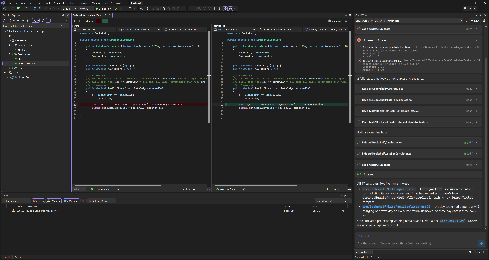
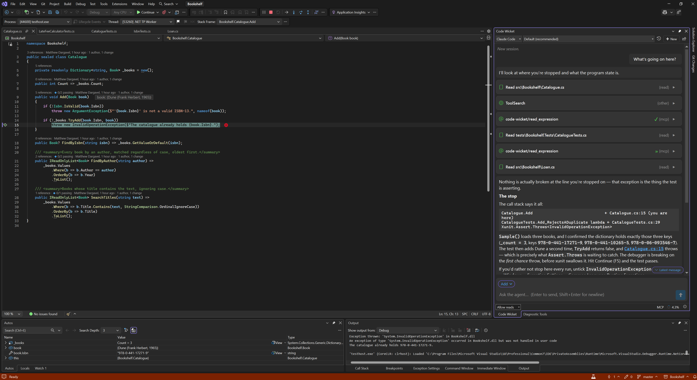
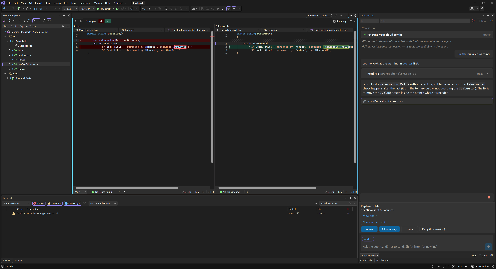

# Code Wicket

**One gateway. Every agent.**

Connect Claude Code, Kiro, or any ACP-enabled agent to Visual Studio 2022 and 2026 — with deep IDE
integration: diffs, builds, tests, Roslyn code fixes, and the live debugger.



Code Wicket is the gateway, not the agent. The agent runs in its own command-line tool, under your
own account. Code Wicket hands it your solution's context and a set of real Visual Studio tools,
shows every change it makes as a native Visual Studio diff, and when the agent asks permission, your
permission mode and rules decide whether it goes ahead or waits for you.

## Requirements

| You need | |
|---|---|
| **Visual Studio 2022 or 2026** (17.14 or later / 18.x), Windows x64 | Supported on both. |
| **A backend CLI** | [`kiro-cli`](https://kiro.dev), or `npm install -g @agentclientprotocol/claude-agent-acp` for Claude Code — installed and signed in to yourself. |
| **.NET 10 runtime** (x64) | Code Wicket's engine runs on it. The .NET 10 SDK includes it; otherwise install the [.NET 10 Runtime](https://dotnet.microsoft.com/download/dotnet/10.0). |
| **Node.js 22 or later** | For the Claude Code backend only — its adapter is an npm package. |

**Without a backend the extension does nothing.** Install one first.

## Getting started

1. Install a backend CLI and sign in to it.
2. Install Code Wicket and restart Visual Studio.
3. Open **Extensions → Code Wicket → Code Wicket Chat** and dock it wherever suits you.
4. Open a solution and ask something that exercises the Visual Studio side:
   *"Build the solution and tell me what's failing."*

The [getting started guide](docs/getting-started.md) covers each backend in detail.

## What it does

- **Visual Studio's own answers.** The agent gets tools served over MCP — `build_solution`,
  `get_diagnostics`, `run_tests`, `find_symbol`, `find_references`, `rename_symbol`, `apply_code_fix`
  and more — answered by the IDE's build, Error List, test runner and Roslyn workspace, not by a shell
  guessing at them.
- **Visual Studio edits, and a native diff for every change.** Every edit appears as a card in the
  chat and opens in Visual Studio's diff viewer. Ctrl+Z works where Visual Studio applied the edit —
  Code Wicket's own rename and code-fix tools, and a backend that hands its file writes to the editor.
- **You decide what's approved.** When the agent asks permission, your permission mode decides
  whether it goes ahead or waits for you — four modes, from *Ask each time* (the default) to
  *Allow all* — along with your own allow rules and an always-prompt list that overrides the mode.
- **The debugger, handed over deliberately.** The agent can place breakpoints and read values from a
  stopped process. An evaluation that could *run* code in that process is a separate tool in the top
  permission tier, so when the backend asks about it, only *Allow all*, or a rule you write, lets it
  through without asking you.
- **Bring your own agent.** Kiro and Claude Code ship configured; any other agent that speaks ACP
  over stdio is a few lines of configuration. Conversations save per workspace and resume.

| | |
|---|---|
|  |  |
| *The debugger, handed over: the agent reads the stopped process.* | *Ask each time: the edit waits for you, its diff already open.* |

## What happens to your code

**Code Wicket does not talk to any AI service.** It has no model, no API key and no account of its
own. It launches the backend CLI you installed and signed in to, and everything goes through that.

When you send a message, the backend receives what you typed, a small block describing your
workspace, anything you attached, and whatever the agent then asks for — including the contents of
files it reads. **Assume anything in your solution can end up in the conversation.** That traffic is
between you and your backend's vendor, under their terms and your account with them; we are not a
party to it and cannot see it. If your organisation has rules about where source code may go, they
apply to the backend you choose.

Settings, saved conversations, logs and attachments stay on your machine, under
`%APPDATA%\code-wicket` and `%LOCALAPPDATA%\code-wicket`. Code Wicket does not send its logs
anywhere. [Your data](docs/your-data.md) has the
detail.

## Documentation

- [Documentation index](docs/README.md)
- [Choosing a backend](docs/backends.md)
- [Using the chat](docs/using-the-chat.md)
- [What the agent can do in Visual Studio](docs/ide-tools.md)
- [Permissions](docs/permissions.md)
- [Troubleshooting](docs/troubleshooting.md)

## Building from source

Windows and the [.NET 10 SDK](https://dotnet.microsoft.com/download/dotnet/10.0) are enough to build
everything, including the VSIX — the VSSDK build tools come from NuGet.

```
dotnet build CodeWicket.slnx
dotnet test src/CodeWicket.Tests/CodeWicket.Tests.csproj
```

Build with `dotnet build`, not a standalone `MSBuild.exe`. Running and debugging the extension needs
Visual Studio itself. `scripts/run-gates.ps1` runs the offline verification gates (PowerShell 7).

## Contributing

Bug reports and pull requests are welcome — [CONTRIBUTING.md](CONTRIBUTING.md) covers building,
testing, and the [Contributor License Agreement](CLA.md) a first pull request is asked to sign.
Security problems go to **security@code-wicket.dev**, not a public issue.

## License

[Apache-2.0](LICENSE). See [NOTICE](NOTICE) and [THIRD-PARTY-NOTICES.md](THIRD-PARTY-NOTICES.md).
